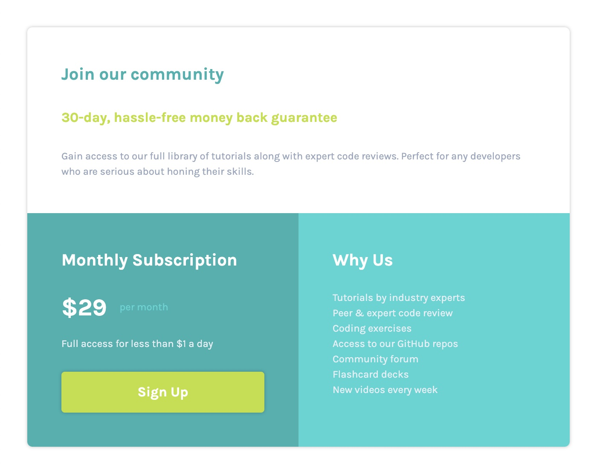

# Frontend Mentor - Single price grid component solution

This is a solution to the [Single price grid component challenge on Frontend Mentor](https://www.frontendmentor.io/challenges/single-price-grid-component-5ce41129d0ff452fec5abbbc). Frontend Mentor challenges help you improve your coding skills by building realistic projects. 

## Table of contents

- [Overview](#overview)
  - [The challenge](#the-challenge)
  - [Screenshot](#screenshot)
  - [Links](#links)
- [My process](#my-process)
  - [Built with](#built-with)
  - [What I learned](#what-i-learned)
  - [Continued development](#continued-development)
- [Author](#author)
- [Acknowledgments](#acknowledgments)

## Overview

### The challenge

Users should be able to:

- View the optimal layout for the component depending on their device's screen size
- See a hover state on desktop for the Sign Up call-to-action

### Screenshots

### Links

- Solution URL: [https://github.com/webdevbynight/single-price-grid-component-master](https://github.com/webdevbynight/single-price-grid-component-master)
- Live Site URL: [https://webdevbynight.github.io/single-price-grid-component-master](https://webdevbynight.github.io/single-price-grid-component-master/)

## My process

### Built with

- Semantic HTML 5 markup
- CSS (via SCSS)
  - Custom properties
  - Grid layout
  - Pseudo-classes
  - Transitions
- Mobile-first workflow

### What I learned

Margin collapse seems not to apply to elements to which the `display: grid;` declaration applies.

### Continued development

I still have to learn about how to make front-end development in a more efficient way and to learn to manage to build web pages without seeming to be too slow.

## Author

- Website - [@webdevbynight](https://github.com/webdevbynight)
- Frontend Mentor - [@webdevbynight](https://www.frontendmentor.io/profile/webdevbynight)

## Acknowledgments

I would like to aknowledge one of the teachers of the course I have been at [Wild Code School](https://www.wildcodeschool.com/en-GB) for having suggested, during the first week of the course, that the students who had made progress in their CSS scheduled exercises to do some of the challenges proposed by Frontend Mentor, if they wished.
